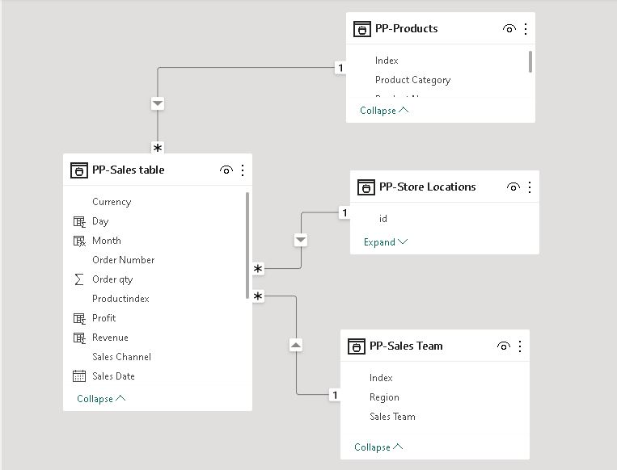
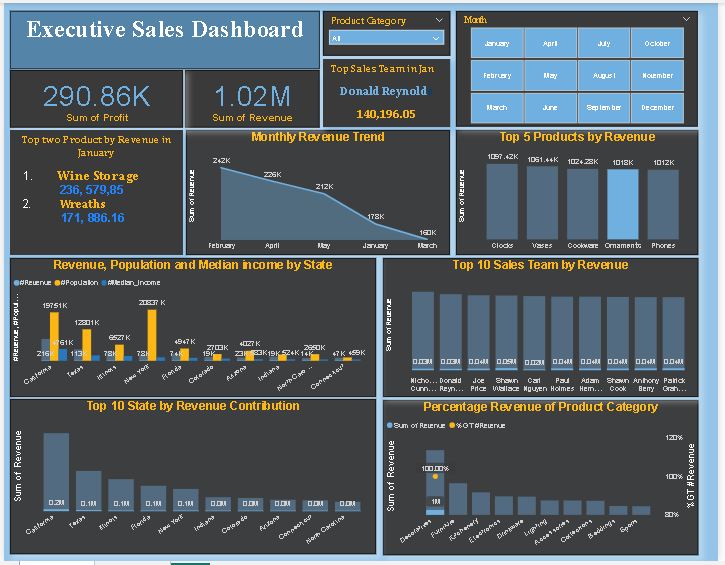
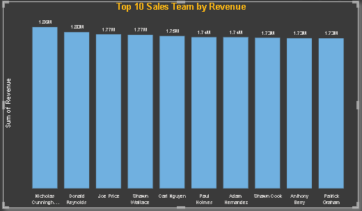
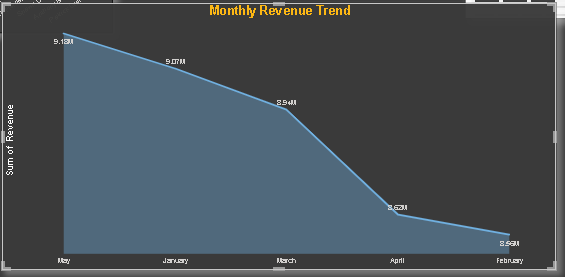

# Executive Sales Report

## Introduction

This project involves analyzing DTLM Retail’s sales data to deliver key insights through Power BI. We’ll calculate revenue and profit for each order, generate reports on revenue trends, top products, sales teams, and state performance, and create an interactive dashboard. Key highlights will include top products and sales teams, as well as insights into revenue, population, and median income by state.

## Table of Content

- [Project Overview](#project-overview)
- [Statement of Problem](#statement-of-problem)
- [Data Source](#data-source)
- [Data Cleaning and Transformation](#data-cleaning-and-transformation)
- [Data Modelling](#data-modelling)
- [Data Analysis and Visualization](#data-analysis-and-visualization)
- [Result and Insights](#result-and-insights)
- [Recommendation](#recommendation)

## Project Overview

DTLM Retail aims to gain actionable insights from its sales data to drive strategic decision-making and optimize business performance. The Sales Director has identified key areas where a comprehensive data analysis can enhance understanding and provide valuable information about the company's operations and market position. 

### Statement of Problem

As the data analyst for DTLM Retail, the Sales Director has requested the following from the dateset provided.
1. Calculate the following for every order: 
- Revenue
- Profit 

2. Make reports for:
 - revenue trend
 - top 5 products by revenue
 - revenue contribution (%) of the product categories
 - top 10 sales team by revenue
 - top 10 states by revenue, also showing their population and median income per state.

3. Create a dashboard with the reports and make it sliceable by:
 - Product Category Product category and Product Catalog:
 - Timeline 

4. Include a textbox to highlight the following insights:
 - Which are the 2 top revenue products in January?
 - Which sales team made most revenue from Decoratives in March?
 - What is the relationship between revenue, population and median income of the states?

## Data Source

This a real world data provided by DTLM retail store. They intended to optimize their sales performance through insightful data analysis. The dataset comprises four sheets: product, sales table, sales team and store location.

Download the sales analysis dataset [here](https://github.com/user-attachments/files/16574263/Sales.Analysis.xlsx)

## Data Cleaning and Transformation

The following data cleaning and transformation processes were carried out before visualization:
- Removing null values
- Removing duplicate
- Calculate new column for revenue = ( unit price * order quantity of product)
- Calculate new column for profit =  (Revenue - (order quantity * cost price)
- Splitting the sales date column into days, month and year.
- Creating new measures for the sum of Revenue, profit, population and median income

## Data Modelling 

The model is a star schema

The csv file contains 4 tables (Product, sales, sales team and location table) which was connected to one another using one to many relationship

## Data Analysis and Visualization

### Products Analysis

- There are 49 products in the store which are group into 10 product categories. 
- The top 5 products by revenue are clock, vases, clockware, ornaments and phone while the top 3 of product category are docorative, furniture and kitchenery.

  
### Sales Team Analysis

- There are 28 sales team and the 10 most performing team in terms revenue are:
  |  Team       |  Revenue(million) |
  |-------------|-------------------|
  |Nicholas Cunningham   |   1.86 |
  |Doanald Reynolds |   1.80 |
  |Joe Price  |   1.77  |
  |Shaw Wallace   |  1.77  |
  |Carl Nguyen  |  1.75  |
  |Paul Holmes  |  1.74 |
  |Adam Hernandez  |  1.74  |
  |Shawn Cook  |  1.73  |
  |Anthony Berry  |  1.73  |
  |Patrick Graham  |  1.73 |
- The sales team with the highest revenue in decoration is Doanald Reynolds.

  
### Monthly Trend

- There is no sales record from June till December
- The best month base on revenue is May follow by January.
- There was a sharp decline of revenue in February after a very profitable January
- The top 2 revenue products in January are wine storage and wreaths

 
### Revenue Contribution by State  

- There are total of 45 state and the 10 top performing of them in terms of revenue are; Califonia, Texas, Illinois, Florida, New York, Indiana, Colorado, Arizona, Connecticut and North Carolina.
- There is a positive correlation between population, median income and revenue. There is high revenue where there is a high population and median income just like the case of Carolina and New York.

  
## Result and Insights

Based on the results of the analysis, the following insights were derived:
- The total revenue generated by the DTML retail store is 44.37m and 12.68m profit.
- May and January are the best performing months in terms of revenue.
- Decorative is the best selling product category with over 30% revenue.
- The top 5 products by revenue are clock, vases, clockware, ornaments and phone

## Recommendation

It is therefore recommended that:
- More advertisement and discounts should be done during January and May to increase sales.😄
- Decorative products should be givrn more atention over other products because it generate over one-quarter of the total revenue.
- Promotion and incentives should be given to the the best performing sales team to motivate them to do more and to bring sales competition among the sales team.
- State with high population and median income should be most targeted for sales for more revenue.

## Limitation

The dataset doesn't cover all the months of the year. So certain generalizations can not be made.😠

